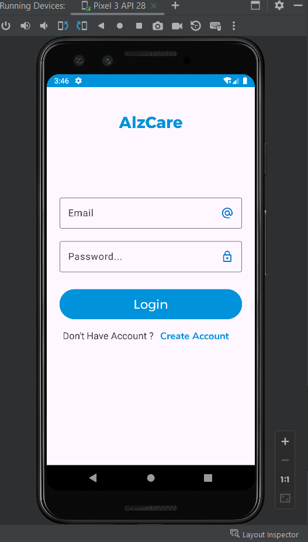
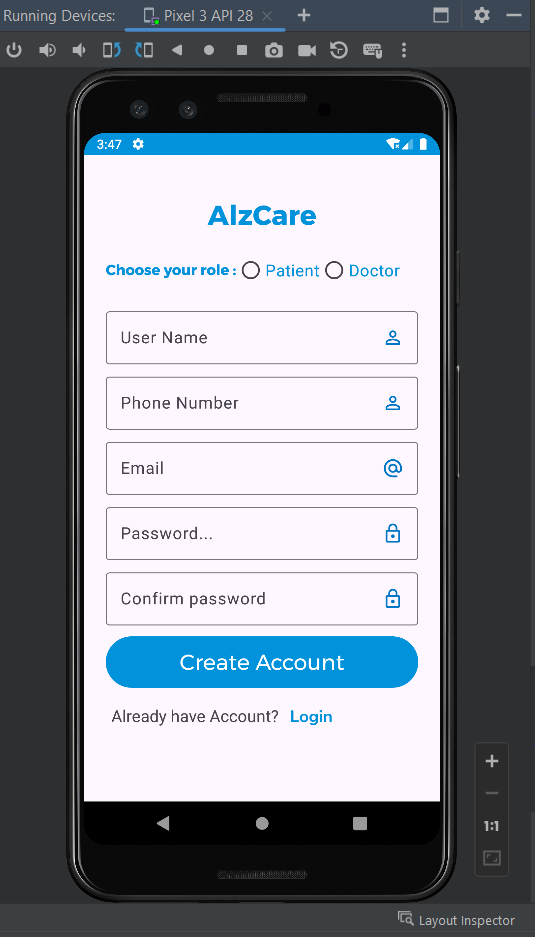
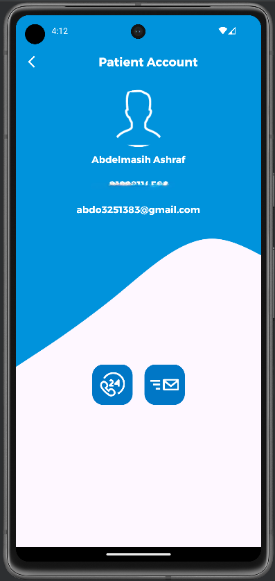
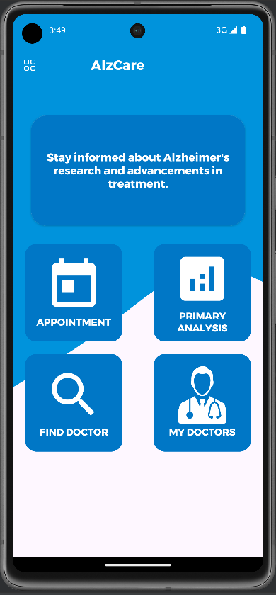
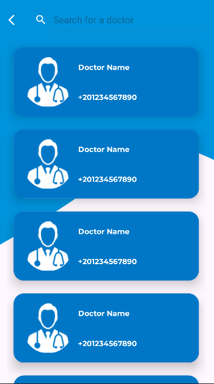
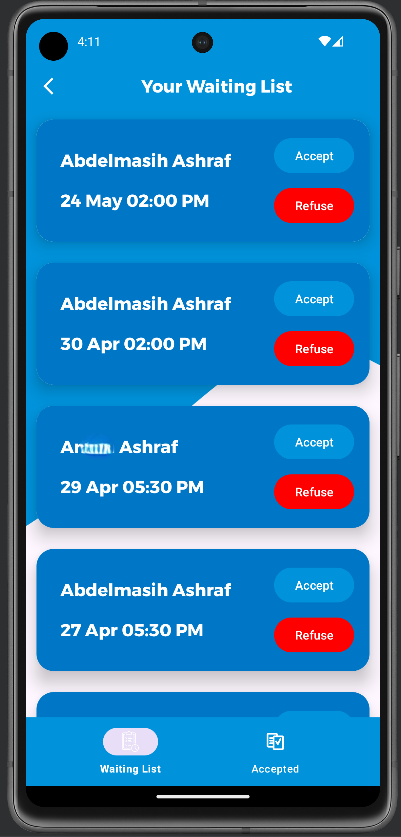

# alz_care 🧠📱

**alz_care** is an Android application designed to support early detection of Alzheimer’s disease and simplify communication between patients and doctors.
The app allows patients to book medical appointments, analyze brain MRI scans using a deep learning model, and manage their medical interactions with doctors.

---

## 🚀 Technologies Used

* **Kotlin**
* **XML Layouts (Android UI)**
* **MVVM Architecture**
* **Firebase Authentication**
* **Firebase Firestore**
* **TensorFlow Lite (CNN Model)**
* **Android Jetpack Components**

---

## 🧠 Core Features

### 🔐 Authentication System

* User registration and login using Firebase Authentication
* Users can register as:

  * **Doctor**
  * **Patient**
* Each role is redirected to a different home interface.

---

## 👨‍⚕️ Doctor Features

### Patient Management

Doctors can view profiles of their patients and manage appointment requests.

### Appointment Management

Doctors have an **Appointments Activity** that contains two fragments:

* **Waiting List**

  * Displays patients requesting appointments
  * Doctor can **Accept or Reject** appointment requests

* **Accepted Appointments**

  * Shows the list of patients whose appointments were approved

---

## 👤 Patient Features

### Medical Tips Slider

* Custom slider implemented **from scratch**
* Automatically cycles through medical tips
* Data is loaded from a **Companion Object list**

### Main Patient Sections

#### 📅 Appointments

Displays upcoming accepted appointments with doctors.

#### 🧠 Primary Analysis

Allows patients to perform an **early Alzheimer’s detection analysis**:

* Upload Brain **MRI Image**
* Run **CNN Model Prediction**
* Model integrated using **TensorFlow Lite**

#### 🔎 Find Doctor

* Search for doctors
* Filter doctors to find the most suitable specialist

#### 👨‍⚕️ My Doctors

Displays doctors the patient has previously visited or booked appointments with.

---

## 🧠 Deep Learning Integration

A **Convolutional Neural Network (CNN)** model is integrated into the application using **TensorFlow Lite** to analyze MRI brain scans and assist in early Alzheimer’s disease detection.

---

## 🏗️ Architecture

The application follows the **MVVM (Model – View – ViewModel)** architecture pattern to ensure:

* Separation of concerns
* Scalable project structure
* Better maintainability

---

## 📱 App Screenshots

  
  
  

  
  
  

